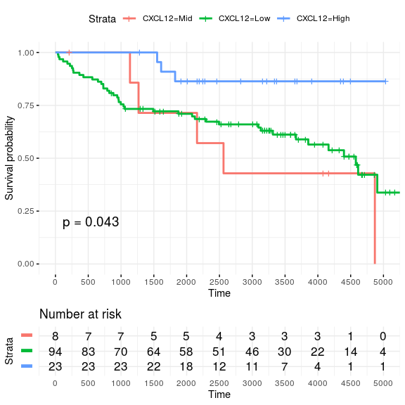
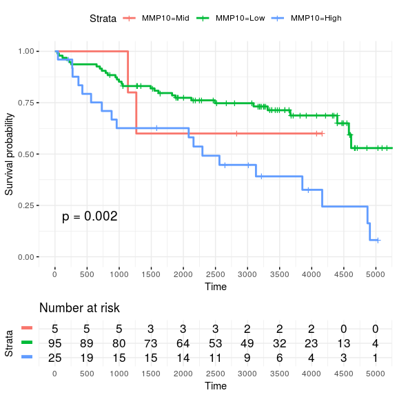

Standard regression functions in R enabled for parallel processing over large data-frames
================
Kevin Blighe
2019-12-16

-   [Introduction](#introduction)
-   [Installation](#installation)
    -   [1. Download the package from Bioconductor](#download-the-package-from-bioconductor)
    -   [2. Load the package into R session](#load-the-package-into-r-session)
-   [Quick start](#quick-start)
    -   [Perform the most basic logistic regression analysis](#perform-the-most-basic-logistic-regression-analysis)
    -   [Perform a basic linear regression](#perform-a-basic-linear-regression)
    -   [Survival analysis via Cox Proportional Hazards regression](#survival-analysis-via-cox-proportional-hazards-regression)
    -   [Perform a conditional logistic regression](#perform-a-conditional-logistic-regression)
-   [Advanced features](#advanced-features)
    -   [Speed up processing](#speed-up-processing)
        -   [~2000 tests; blocksize, 500; cores, 2; nestedParallel, TRUE](#tests-blocksize-500-cores-2-nestedparallel-true)
        -   [~2000 tests; blocksize, 500; cores, 2; nestedParallel, FALSE](#tests-blocksize-500-cores-2-nestedparallel-false)
        -   [~40000 tests; blocksize, 2000; cores, 2; nestedParallel, TRUE](#tests-blocksize-2000-cores-2-nestedparallel-true)
        -   [~40000 tests; blocksize, 2000; cores, 2; nestedParallel, FALSE](#tests-blocksize-2000-cores-2-nestedparallel-false)
        -   [~40000 tests; blocksize, 5000; cores, 3; nestedParallel, TRUE](#tests-blocksize-5000-cores-3-nestedparallel-true)
    -   [Modify confidence intervals](#modify-confidence-intervals)
    -   [Remove some terms from output / include the intercept](#remove-some-terms-from-output-include-the-intercept)
-   [Acknowledgments](#acknowledgments)
-   [Session info](#session-info)
-   [References](#references)

Introduction
============

In many analyses, a large amount of variables have to be tested independently against the trait/endpoint of interest, and also adjusted for covariates and confounding factors at the same time. The major bottleneck in these is the amount of time that it takes to complete these analyses.

With <i>RegParallel</i>, a large number of tests can be performed simultaneously. On a 12-core system, 144 variables can be tested simultaneously, with 1000s of variables processed in a matter of seconds via 'nested' parallel processing.

Works for logistic regression, linear regression, conditional logistic regression, Cox proportional hazards and survival models, and Bayesian logistic regression.

Installation
============

1. Download the package from Bioconductor
-----------------------------------------

``` r
    if (!requireNamespace('BiocManager', quietly = TRUE))
        install.packages('BiocManager')

    BiocManager::install('RegParallel')
```

Note: to install development version:

``` r
    devtools::install_github('kevinblighe/RegParallel')
```

2. Load the package into R session
----------------------------------

``` r
    library(RegParallel)
```

Quick start
===========

For this quick start, we will follow the tutorial (from Section 3.1) of [RNA-seq workflow: gene-level exploratory analysis and differential expression](http://master.bioconductor.org/packages/release/workflows/vignettes/rnaseqGene/inst/doc/rnaseqGene.html). Specifically, we will load the 'airway' data, where different airway smooth muscle cells were treated with dexamethasone.

``` r
    library(airway)
    library(magrittr)

    data('airway')
    airway$dex %<>% relevel('untrt')
```

Normalise the raw counts in <i>DESeq2</i> and produce regularised log expression levels:

``` r
    library(DESeq2)

    dds <- DESeqDataSet(airway, design = ~ dex + cell)
    dds <- DESeq(dds, betaPrior = FALSE)
    rldexpr <- assay(rlog(dds, blind = FALSE))
    rlddata <- data.frame(colData(airway), t(rldexpr))
```

Perform the most basic logistic regression analysis
---------------------------------------------------

Here, we fit a binomial logistic regression model to the data via <i>glmParallel</i>, with dexamethasone as the dependent variable.

``` r
    ## NOT RUN

    res1 <- RegParallel(
      data = rlddata[ ,1:3000],
      formula = 'dex ~ [*]',
      FUN = function(formula, data)
        glm(formula = formula,
          data = data,
          family = binomial(link = 'logit')),
      FUNtype = 'glm',
      variables = colnames(rlddata)[10:3000])

    res1[order(res1$P, decreasing=FALSE),]
```

Perform a basic linear regression
---------------------------------

Here, we will perform the linear regression using both <i>glmParallel</i> and <i>lmParallel</i>. We will appreciate that a linear regression is the same using either function with the default settings.

Regularised log expression levels from our <i>DESeq2</i> data will be used.

``` r
  rlddata <- rlddata[ ,1:2000]

  res2 <- RegParallel(
    data = rlddata,
    formula = '[*] ~ cell',
    FUN = function(formula, data)
      glm(formula = formula,
        data = data,
        method = 'glm.fit'),
    FUNtype = 'glm',
    variables = colnames(rlddata)[10:ncol(rlddata)],
    p.adjust = "none")

  res3 <- RegParallel(
    data = rlddata,
    formula = '[*] ~ cell',
    FUN = function(formula, data)
      lm(formula = formula,
        data = data),
    FUNtype = 'lm',
    variables = colnames(rlddata)[10:ncol(rlddata)],
    p.adjust = "none")

  subset(res2, P<0.05)
```

    ##             Variable        Term        Beta StandardError          t
    ##   1: ENSG00000001461 cellN061011 -0.46859875    0.10526111  -4.451775
    ##   2: ENSG00000001461 cellN080611 -0.84020922    0.10526111  -7.982143
    ##   3: ENSG00000001461  cellN61311 -0.87778101    0.10526111  -8.339082
    ##   4: ENSG00000001561 cellN080611 -1.71802758    0.13649920 -12.586357
    ##   5: ENSG00000001561  cellN61311 -1.05328889    0.13649920  -7.716448
    ##  ---                                                                 
    ## 519: ENSG00000092108 cellN061011 -0.12721659    0.01564082  -8.133625
    ## 520: ENSG00000092108  cellN61311 -0.12451203    0.01564082  -7.960708
    ## 521: ENSG00000092148 cellN080611 -0.34988071    0.10313461  -3.392467
    ## 522: ENSG00000092200 cellN080611  0.05906656    0.01521063   3.883241
    ## 523: ENSG00000092208 cellN080611 -0.28587683    0.08506716  -3.360602
    ##                 P        OR   ORlower   ORupper
    ##   1: 0.0112313246 0.6258787 0.5092039 0.7692873
    ##   2: 0.0013351958 0.4316202 0.3511586 0.5305181
    ##   3: 0.0011301853 0.4157043 0.3382098 0.5109554
    ##   4: 0.0002293465 0.1794197 0.1373036 0.2344544
    ##   5: 0.0015182960 0.3487887 0.2669157 0.4557753
    ##  ---                                           
    ## 519: 0.0012429963 0.8805429 0.8539591 0.9079544
    ## 520: 0.0013489163 0.8829276 0.8562718 0.9104133
    ## 521: 0.0274674209 0.7047722 0.5757851 0.8626549
    ## 522: 0.0177922771 1.0608458 1.0296864 1.0929482
    ## 523: 0.0282890537 0.7513552 0.6359690 0.8876762

``` r
  subset(res3, P<0.05)
```

    ##             Variable        Term        Beta StandardError          t
    ##   1: ENSG00000001461 cellN061011 -0.46859875    0.10526111  -4.451775
    ##   2: ENSG00000001461 cellN080611 -0.84020922    0.10526111  -7.982143
    ##   3: ENSG00000001461  cellN61311 -0.87778101    0.10526111  -8.339082
    ##   4: ENSG00000001561 cellN080611 -1.71802758    0.13649920 -12.586357
    ##   5: ENSG00000001561  cellN61311 -1.05328889    0.13649920  -7.716448
    ##  ---                                                                 
    ## 519: ENSG00000092108 cellN061011 -0.12721659    0.01564082  -8.133625
    ## 520: ENSG00000092108  cellN61311 -0.12451203    0.01564082  -7.960708
    ## 521: ENSG00000092148 cellN080611 -0.34988071    0.10313461  -3.392467
    ## 522: ENSG00000092200 cellN080611  0.05906656    0.01521063   3.883241
    ## 523: ENSG00000092208 cellN080611 -0.28587683    0.08506716  -3.360602
    ##                 P        OR   ORlower   ORupper
    ##   1: 0.0112313246 0.6258787 0.5092039 0.7692873
    ##   2: 0.0013351958 0.4316202 0.3511586 0.5305181
    ##   3: 0.0011301853 0.4157043 0.3382098 0.5109554
    ##   4: 0.0002293465 0.1794197 0.1373036 0.2344544
    ##   5: 0.0015182960 0.3487887 0.2669157 0.4557753
    ##  ---                                           
    ## 519: 0.0012429963 0.8805429 0.8539591 0.9079544
    ## 520: 0.0013489163 0.8829276 0.8562718 0.9104133
    ## 521: 0.0274674209 0.7047722 0.5757851 0.8626549
    ## 522: 0.0177922771 1.0608458 1.0296864 1.0929482
    ## 523: 0.0282890537 0.7513552 0.6359690 0.8876762

Survival analysis via Cox Proportional Hazards regression
---------------------------------------------------------

For this example, we will load breast cancer gene expression data with recurrence free survival (RFS) from [Gene Expression Profiling in Breast Cancer: Understanding the Molecular Basis of Histologic Grade To Improve Prognosis](https://www.ncbi.nlm.nih.gov/geo/query/acc.cgi?acc=GSE2990). Specifically, we will encode each gene's expression into Low|Mid|High based on Z-scores and compare these against RFS while adjusting for tumour grade in a Cox Proportional Hazards model.

First, let's read in and prepare the data:

``` r
  library(Biobase)
  library(GEOquery)
  # load series and platform data from GEO
  gset <- getGEO('GSE2990', GSEMatrix =TRUE, getGPL=FALSE)
  x <- exprs(gset[[1]])
  # remove Affymetrix control probes
  x <- x[-grep('^AFFX', rownames(x)),]
  # transform the expression data to Z scores
  x <- t(scale(t(x)))
  # extract information of interest from the phenotype data (pdata)
  idx <- which(colnames(pData(gset[[1]])) %in%
    c('age:ch1', 'distant rfs:ch1', 'er:ch1',
      'ggi:ch1', 'grade:ch1', 'node:ch1',
      'size:ch1', 'time rfs:ch1'))
  metadata <- data.frame(pData(gset[[1]])[,idx],
    row.names = rownames(pData(gset[[1]])))
  # remove samples from the pdata that have any NA value
  discard <- apply(metadata, 1, function(x) any(is.na(x)))
  metadata <- metadata[!discard,]
  # filter the Z-scores expression data to match the samples in our pdata
  x <- x[,which(colnames(x) %in% rownames(metadata))]
  # check that sample names match exactly between pdata and Z-scores 
  all((colnames(x) == rownames(metadata)) == TRUE)
```

    ## [1] TRUE

``` r
  # create a merged pdata and Z-scores object
  coxdata <- data.frame(metadata, t(x))
  # tidy column names
  colnames(coxdata)[1:8] <- c('Age', 'Distant.RFS', 'ER',
    'GGI', 'Grade', 'Node',
    'Size', 'Time.RFS')
  # prepare certain phenotypes
  coxdata$Age <- as.numeric(gsub('^KJ', '', coxdata$Age))
  coxdata$Distant.RFS <- as.numeric(coxdata$Distant.RFS)
  coxdata$ER <- factor(coxdata$ER, levels = c(0, 1))
  coxdata$Grade <- factor(coxdata$Grade, levels = c(1, 2, 3))
  coxdata$Time.RFS <- as.numeric(gsub('^KJX|^KJ', '', coxdata$Time.RFS))
```

With the data prepared, we can now apply a Cox Proportional Hazards model independently for each probe in the dataset against RFS.

In this we also increase the default blocksize to 2000 in order to speed up the analysis.

``` r
  library(survival)
  res5 <- RegParallel(
    data = coxdata,
    formula = 'Surv(Time.RFS, Distant.RFS) ~ [*]',
    FUN = function(formula, data)
      coxph(formula = formula,
        data = data,
        ties = 'breslow',
        singular.ok = TRUE),
    FUNtype = 'coxph',
    variables = colnames(coxdata)[9:ncol(coxdata)],
    blocksize = 2000,
    p.adjust = "BH")
  res5 <- res5[!is.na(res5$P),]
  res5
```

    ##           Variable        Term          Beta StandardError             Z
    ##     1:  X1007_s_at  X1007_s_at  0.3780639987     0.3535022  1.0694811914
    ##     2:    X1053_at    X1053_at  0.1177398813     0.2275041  0.5175285346
    ##     3:     X117_at     X117_at  0.6265036787     0.6763106  0.9263549892
    ##     4:     X121_at     X121_at -0.6138126274     0.6166626 -0.9953783151
    ##     5:  X1255_g_at  X1255_g_at -0.2043297829     0.3983930 -0.5128849375
    ##    ---                                                                  
    ## 22211:   X91703_at   X91703_at -0.4124539527     0.4883759 -0.8445419981
    ## 22212: X91816_f_at X91816_f_at  0.0482030943     0.3899180  0.1236236554
    ## 22213:   X91826_at   X91826_at  0.0546751431     0.3319572  0.1647053850
    ## 22214:   X91920_at   X91920_at -0.6452125945     0.8534623 -0.7559942684
    ## 22215:   X91952_at   X91952_at -0.0001396044     0.7377681 -0.0001892254
    ##                P       LRT      Wald   LogRank        HR    HRlower  HRupper
    ##     1: 0.2848529 0.2826716 0.2848529 0.2848400 1.4594563 0.72994385 2.918050
    ##     2: 0.6047873 0.6085603 0.6047873 0.6046839 1.1249515 0.72024775 1.757056
    ##     3: 0.3542615 0.3652989 0.3542615 0.3541855 1.8710573 0.49706191 7.043097
    ##     4: 0.3195523 0.3188303 0.3195523 0.3186921 0.5412832 0.16162940 1.812712
    ##     5: 0.6080318 0.6084157 0.6080318 0.6077573 0.8151935 0.37337733 1.779809
    ##    ---                                                                      
    ## 22211: 0.3983666 0.3949865 0.3983666 0.3981244 0.6620237 0.25419512 1.724169
    ## 22212: 0.9016133 0.9015048 0.9016133 0.9016144 1.0493838 0.48869230 2.253373
    ## 22213: 0.8691759 0.8691994 0.8691759 0.8691733 1.0561974 0.55103934 2.024453
    ## 22214: 0.4496526 0.4478541 0.4496526 0.4498007 0.5245510 0.09847349 2.794191
    ## 22215: 0.9998490 0.9998490 0.9998490 0.9998490 0.9998604 0.23547784 4.245498
    ##         P.adjust LRT.adjust Wald.adjust LogRank.adjust
    ##     1: 0.9999969  0.9999969   0.9999969      0.9999969
    ##     2: 0.9999969  0.9999969   0.9999969      0.9999969
    ##     3: 0.9999969  0.9999969   0.9999969      0.9999969
    ##     4: 0.9999969  0.9999969   0.9999969      0.9999969
    ##     5: 0.9999969  0.9999969   0.9999969      0.9999969
    ##    ---                                                
    ## 22211: 0.9999969  0.9999969   0.9999969      0.9999969
    ## 22212: 0.9999969  0.9999969   0.9999969      0.9999969
    ## 22213: 0.9999969  0.9999969   0.9999969      0.9999969
    ## 22214: 0.9999969  0.9999969   0.9999969      0.9999969
    ## 22215: 0.9999969  0.9999969   0.9999969      0.9999969

We now take the top probes from the model by Log Rank p-value and use <i>biomaRt</i> to look up the corresponding gene symbols.

``` r
  res5 <- res5[order(res5$LogRank, decreasing = FALSE),]
  final <- subset(res5, LogRank < 0.01)
  probes <- gsub('^X', '', final$Variable)
  library(biomaRt)
  mart <- useMart('ENSEMBL_MART_ENSEMBL')
  mart <- useDataset("hsapiens_gene_ensembl", mart)
  annotLookup <- getBM(mart = mart,
    attributes = c('affy_hg_u133a',
      'ensembl_gene_id',
      'gene_biotype',
      'external_gene_name'),
    filter = 'affy_hg_u133a',
    values = probes,
    uniqueRows = TRUE)
```

Two of the top hits include <i>CXCL12</i> and <i>MMP10</i>. High expression of <i>CXCL12</i> was previously associated with good progression free and overall survival in breast cancer in (doi: 10.1016/j.cca.2018.05.041.)\[<https://www.ncbi.nlm.nih.gov/pubmed/29800557>\] , whilst high expression of <i>MMP10</i> was associated with poor prognosis in colon cancer in (doi: 10.1186/s12885-016-2515-7)\[<https://www.ncbi.nlm.nih.gov/pmc/articles/PMC4950722/>\].

We can further explore the role of these genes to RFS by dividing their gene expression Z-scores into tertiles for low, mid, and high expression:

``` r
  # extract RFS and probe data for downstream analysis
  survplotdata <- coxdata[,c('Time.RFS', 'Distant.RFS',
    'X203666_at', 'X205680_at')]
  colnames(survplotdata) <- c('Time.RFS', 'Distant.RFS',
    'CXCL12', 'MMP10')
  # set Z-scale cut-offs for high and low expression
  highExpr <- 1.0
  lowExpr <- 1.0
  # encode the expression for CXCL12 and MMP10 as low, mid, and high
  survplotdata$CXCL12 <- ifelse(survplotdata$CXCL12 >= highExpr, 'High',
    ifelse(x <= lowExpr, 'Low', 'Mid'))
  survplotdata$MMP10 <- ifelse(survplotdata$MMP10 >= highExpr, 'High',
    ifelse(x <= lowExpr, 'Low', 'Mid'))
  # relevel the factors to have mid as the reference level
  survplotdata$CXCL12 <- factor(survplotdata$CXCL12,
    levels = c('Mid', 'Low', 'High'))
  survplotdata$MMP10 <- factor(survplotdata$MMP10,
    levels = c('Mid', 'Low', 'High'))
```

Plot the survival curves and place Log Rank p-value in the plots:

``` r
  library(survminer)
  ggsurvplot(survfit(Surv(Time.RFS, Distant.RFS) ~ CXCL12,
    data = survplotdata),
    data = survplotdata,
    risk.table = TRUE,
    pval = TRUE,
    break.time.by = 500,
    ggtheme = theme_minimal(),
    risk.table.y.text.col = TRUE,
    risk.table.y.text = FALSE)
```



``` r
  ggsurvplot(survfit(Surv(Time.RFS, Distant.RFS) ~ MMP10,
    data = survplotdata),
    data = survplotdata,
    risk.table = TRUE,
    pval = TRUE,
    break.time.by = 500,
    ggtheme = theme_minimal(),
    risk.table.y.text.col = TRUE,
    risk.table.y.text = FALSE)
```



Perform a conditional logistic regression
-----------------------------------------

In this example, we will re-use the Cox data for the purpose of performing conditional logistic regression with tumour grade as our grouping / matching factor. For this example, we will use ER status as the dependent variable and also adjust for age.

``` r
  x <- exprs(gset[[1]])
  x <- x[-grep('^AFFX', rownames(x)),]
  x <- scale(x)
  x <- x[,which(colnames(x) %in% rownames(metadata))]

  coxdata <- data.frame(metadata, t(x))

  colnames(coxdata)[1:8] <- c('Age', 'Distant.RFS', 'ER',
    'GGI', 'Grade', 'Node',
    'Size', 'Time.RFS')

  coxdata$Age <- as.numeric(gsub('^KJ', '', coxdata$Age))
  coxdata$Grade <- factor(coxdata$Grade, levels = c(1, 2, 3))
  coxdata$ER <- as.numeric(coxdata$ER)
  coxdata <- coxdata[!is.na(coxdata$ER),]

  res6 <- RegParallel(
    data = coxdata,
    formula = 'ER ~ [*] + Age + strata(Grade)',
    FUN = function(formula, data)
      clogit(formula = formula,
        data = data,
        method = 'breslow'),
    FUNtype = 'clogit',
    variables = colnames(coxdata)[9:ncol(coxdata)],
    blocksize = 2000)

  subset(res6, P < 0.01)
```

    ##        Variable         Term       Beta StandardError         Z           P
    ## 1:   X204667_at   X204667_at  0.9940504     0.3628087  2.739875 0.006146252
    ## 2:   X205225_at   X205225_at  0.4444556     0.1633857  2.720285 0.006522559
    ## 3: X207813_s_at X207813_s_at  0.8218501     0.3050777  2.693904 0.007062046
    ## 4:   X212108_at   X212108_at  1.9610211     0.7607284  2.577820 0.009942574
    ## 5: X219497_s_at X219497_s_at -1.0249671     0.3541401 -2.894242 0.003800756
    ##            LRT       Wald    LogRank        HR   HRlower   HRupper
    ## 1: 0.006808415 0.02212540 0.02104525 2.7021573 1.3270501  5.502169
    ## 2: 0.010783544 0.01941078 0.01701248 1.5596409 1.1322713  2.148319
    ## 3: 0.037459927 0.02449358 0.02424809 2.2747043 1.2509569  4.136257
    ## 4: 0.033447973 0.03356050 0.03384960 7.1065797 1.6000274 31.564132
    ## 5: 0.005153233 0.01387183 0.01183245 0.3588083 0.1792329  0.718302

``` r
  getBM(mart = mart,
    attributes = c('affy_hg_u133a',
      'ensembl_gene_id',
      'gene_biotype',
      'external_gene_name'),
    filter = 'affy_hg_u133a',
    values = c('204667_at',
      '205225_at',
      '207813_s_at',
      '212108_at',
      '219497_s_at'),
    uniqueRows=TRUE)
```

    ##   affy_hg_u133a ensembl_gene_id   gene_biotype external_gene_name
    ## 1   219497_s_at ENSG00000119866 protein_coding             BCL11A
    ## 2     212108_at ENSG00000113194 protein_coding               FAF2
    ## 3   207813_s_at ENSG00000161513 protein_coding               FDXR
    ## 4     205225_at ENSG00000091831 protein_coding               ESR1

Oestrogen receptor (<i>ESR1</i>) comes out top - makes sense! Also, although 204667\_at is not listed in <i>biomaRt</i>, it overlaps an exon of <i>FOXA1</i>, which also makes sense in relation to oestrogen signalling.

Advanced features
=================

Advanced features include the ability to modify block size, choose different numbers of cores, enable 'nested' parallel processing, modify limits for confidence intervals, and exclude certain model terms from output.

Speed up processing
-------------------

First create some test data for the purpose of benchmarking:

``` r
  options(scipen=10)
  options(digits=6)

  # create a data-matrix of 20 x 60000 (rows x cols) random numbers
  col <- 60000
  row <- 20
  mat <- matrix(
    rexp(col*row, rate = .1),
    ncol = col)

  # add fake gene and sample names
  colnames(mat) <- paste0('gene', 1:ncol(mat))

  rownames(mat) <- paste0('sample', 1:nrow(mat))

  # add some fake metadata
  modelling <- data.frame(
    cell = rep(c('B', 'T'), nrow(mat) / 2),
    group = c(rep(c('treatment'), nrow(mat) / 2), rep(c('control'), nrow(mat) / 2)),
    dosage = t(data.frame(matrix(rexp(row, rate = 1), ncol = row))),
    mat,
    row.names = rownames(mat))
```

### ~2000 tests; blocksize, 500; cores, 2; nestedParallel, TRUE

With 2 cores instead of the default of 3, coupled with nestedParallel being enabled, a total of 2 x 2 = 4 threads will be used.

``` r
  df <- modelling[ ,1:2000]
  variables <- colnames(df)[4:ncol(df)]

  ptm <- proc.time()

  res <- RegParallel(
    data = df,
    formula = 'factor(group) ~ [*] + (cell:dosage) ^ 2',
    FUN = function(formula, data)
      glm(formula = formula,
        data = data,
        family = binomial(link = 'logit'),
        method = 'glm.fit'),
    FUNtype = 'glm',
    variables = variables,
    blocksize = 500,
    cores = 2,
    nestedParallel = TRUE,
    p.adjust = "BY")

  proc.time() - ptm
```

    ##    user  system elapsed 
    ##   0.844   0.092  10.210

### ~2000 tests; blocksize, 500; cores, 2; nestedParallel, FALSE

``` r
  df <- modelling[ ,1:2000]
  variables <- colnames(df)[4:ncol(df)]

  ptm <- proc.time()

  res <- RegParallel(
    data = df,
    formula = 'factor(group) ~ [*] + (cell:dosage) ^ 2',
    FUN = function(formula, data)
      glm(formula = formula,
        data = data,
        family = binomial(link = 'logit'),
        method = 'glm.fit'),
    FUNtype = 'glm',
    variables = variables,
    blocksize = 500,
    cores = 2,
    nestedParallel = FALSE,
    p.adjust = "BY")

  proc.time() - ptm
```

    ##    user  system elapsed 
    ##   0.992   0.172  10.128

Focusing on the elapsed time (as system time only reports time from the last core that finished), we can see that nested processing has negligible improvement or may actually be slower under certain conditions when tested over a small number of variables. This is likely due to the system being slowed by simply managing the larger number of threads. Nested processing's benefits can only be gained when processing a large number of variables:

### ~40000 tests; blocksize, 2000; cores, 2; nestedParallel, TRUE

``` r
  df <- modelling[ ,1:40000]
  variables <- colnames(df)[4:ncol(df)]

  system.time(RegParallel(
    data = df,
    formula = 'factor(group) ~ [*] + (cell:dosage) ^ 2',
    FUN = function(formula, data)
      glm(formula = formula,
        data = data,
        family = binomial(link = 'logit'),
        method = 'glm.fit'),
    FUNtype = 'glm',
    variables = variables,
    blocksize = 2000,
    cores = 2,
    nestedParallel = TRUE))
```

    ##    user  system elapsed 
    ## 354.888  43.468 225.866

### ~40000 tests; blocksize, 2000; cores, 2; nestedParallel, FALSE

``` r
  df <- modelling[,1:40000]
  variables <- colnames(df)[4:ncol(df)]

  system.time(RegParallel(
    data = df,
    formula = 'factor(group) ~ [*] + (cell:dosage) ^ 2',
    FUN = function(formula, data)
      glm(formula = formula,
        data = data,
        family = binomial(link = 'logit'),
        method = 'glm.fit'),
    FUNtype = 'glm',
    variables = variables,
    blocksize = 2000,
    cores = 2,
    nestedParallel = FALSE))
```

    ##    user  system elapsed 
    ## 246.200   1.204 248.726

Performance is system-dependent and even increasing cores may not result in huge gains in time. Performance is a trade-off between cores, forked threads, blocksize, and the number of terms in each model.

### ~40000 tests; blocksize, 5000; cores, 3; nestedParallel, TRUE

In this example, we choose a large blocksize and 3 cores. With nestedParallel enabled, this translates to 9 simultaneous threads.

``` r
  df <- modelling[,1:40000]
  variables <- colnames(df)[4:ncol(df)]

  system.time(RegParallel(
    data = df,
    formula = 'factor(group) ~ [*] + (cell:dosage) ^ 2',
    FUN = function(formula, data)
      glm(formula = formula,
        data = data,
        family = binomial(link = 'logit'),
        method = 'glm.fit'),
    FUNtype = 'glm',
    variables = variables,
    blocksize = 5000,
    cores = 3,
    nestedParallel = TRUE))
```

    ##    user  system elapsed 
    ## 643.484  25.924 306.247

Modify confidence intervals
---------------------------

``` r
  df <- modelling[ ,1:500]
  variables <- colnames(df)[4:ncol(df)]

  # 99% confidfence intervals
  RegParallel(
    data = df,
    formula = 'factor(group) ~ [*] + (cell:dosage) ^ 2',
    FUN = function(formula, data)
      glm(formula = formula,
        data = data,
        family = binomial(link = 'logit'),
        method = 'glm.fit'),
    FUNtype = 'glm',
    variables = variables,
    blocksize = 150,
    cores = 3,
    nestedParallel = TRUE,
    conflevel = 99)
```

    ##       Variable         Term        Beta StandardError          Z        P
    ##    1:    gene1        gene1  0.00443547     0.0547748  0.0809765 0.935461
    ##    2:    gene1 cellB:dosage  0.37758175     1.2573546  0.3002985 0.763949
    ##    3:    gene1 cellT:dosage -0.40671825     0.6446631 -0.6309004 0.528106
    ##    4:    gene2        gene2  0.01798755     0.0331681  0.5423152 0.587601
    ##    5:    gene2 cellB:dosage  0.52132606     1.3128193  0.3971042 0.691291
    ##   ---                                                                    
    ## 1487:  gene496 cellB:dosage  0.23298222     1.3026778  0.1788487 0.858057
    ## 1488:  gene496 cellT:dosage -0.56644380     0.7911379 -0.7159861 0.474000
    ## 1489:  gene497      gene497 -0.04495742     0.0691750 -0.6499084 0.515751
    ## 1490:  gene497 cellB:dosage  0.78127123     1.4126572  0.5530508 0.580229
    ## 1491:  gene497 cellT:dosage -0.29108959     0.6571047 -0.4429881 0.657774
    ##             OR   ORlower  ORupper
    ##    1: 1.004445 0.8722711  1.15665
    ##    2: 1.458753 0.0572030 37.20014
    ##    3: 0.665832 0.1265319  3.50372
    ##    4: 1.018150 0.9347766  1.10896
    ##    5: 1.684260 0.0572532 49.54713
    ##   ---                            
    ## 1487: 1.262359 0.0440472 36.17824
    ## 1488: 0.567540 0.0739564  4.35530
    ## 1489: 0.956038 0.8000025  1.14251
    ## 1490: 2.184247 0.0574125 83.09920
    ## 1491: 0.747449 0.1375622  4.06129

``` r
  # 95% confidfence intervals (default)
  RegParallel(
    data = df,
    formula = 'factor(group) ~ [*] + (cell:dosage) ^ 2',
    FUN = function(formula, data)
      glm(formula = formula,
        data = data,
        family = binomial(link = 'logit'),
        method = 'glm.fit'),
    FUNtype = 'glm',
    variables = variables,
    blocksize = 150,
    cores = 3,
    nestedParallel = TRUE,
    conflevel = 95)
```

    ##       Variable         Term        Beta StandardError          Z        P
    ##    1:    gene1        gene1  0.00443547     0.0547748  0.0809765 0.935461
    ##    2:    gene1 cellB:dosage  0.37758175     1.2573546  0.3002985 0.763949
    ##    3:    gene1 cellT:dosage -0.40671825     0.6446631 -0.6309004 0.528106
    ##    4:    gene2        gene2  0.01798755     0.0331681  0.5423152 0.587601
    ##    5:    gene2 cellB:dosage  0.52132606     1.3128193  0.3971042 0.691291
    ##   ---                                                                    
    ## 1487:  gene496 cellB:dosage  0.23298222     1.3026778  0.1788487 0.858057
    ## 1488:  gene496 cellT:dosage -0.56644380     0.7911379 -0.7159861 0.474000
    ## 1489:  gene497      gene497 -0.04495742     0.0691750 -0.6499084 0.515751
    ## 1490:  gene497 cellB:dosage  0.78127123     1.4126572  0.5530508 0.580229
    ## 1491:  gene497 cellT:dosage -0.29108959     0.6571047 -0.4429881 0.657774
    ##             OR  ORlower  ORupper
    ##    1: 1.004445 0.902198  1.11828
    ##    2: 1.458753 0.124085 17.14920
    ##    3: 0.665832 0.188203  2.35561
    ##    4: 1.018150 0.954068  1.08654
    ##    5: 1.684260 0.128510 22.07409
    ##   ---                           
    ## 1487: 1.262359 0.098252 16.21901
    ## 1488: 0.567540 0.120387  2.67556
    ## 1489: 0.956038 0.834821  1.09486
    ## 1490: 2.184247 0.137040 34.81431
    ## 1491: 0.747449 0.206183  2.70963

Remove some terms from output / include the intercept
-----------------------------------------------------

``` r
  # remove terms but keep Intercept
  RegParallel(
    data = df,
    formula = 'factor(group) ~ [*] + (cell:dosage) ^ 2',
    FUN = function(formula, data)
      glm(formula = formula,
        data = data,
        family = binomial(link = 'logit'),
        method = 'glm.fit'),
    FUNtype = 'glm',
    variables = variables,
    blocksize = 150,
    cores = 3,
    nestedParallel = TRUE,
    conflevel = 95,
    excludeTerms = c('cell', 'dosage'),
    excludeIntercept = FALSE)
```

    ##      Variable        Term        Beta StandardError          Z        P
    ##   1:    gene1 (Intercept)  0.05531902     0.8741308  0.0632846 0.949540
    ##   2:    gene1       gene1  0.00443547     0.0547748  0.0809765 0.935461
    ##   3:    gene2 (Intercept) -0.23161335     0.9318127 -0.2485621 0.803700
    ##   4:    gene2       gene2  0.01798755     0.0331681  0.5423152 0.587601
    ##   5:    gene3 (Intercept) -0.25235970     0.8734532 -0.2889218 0.772641
    ##  ---                                                                   
    ## 990:  gene495     gene495  0.09547305     0.0901530  1.0590117 0.289594
    ## 991:  gene496 (Intercept) -0.14637168     0.7689125 -0.1903620 0.849026
    ## 992:  gene496     gene496  0.03941696     0.0470341  0.8380500 0.402003
    ## 993:  gene497 (Intercept)  0.43576988     0.8753751  0.4978093 0.618618
    ## 994:  gene497     gene497 -0.04495742     0.0691750 -0.6499084 0.515751
    ##            OR  ORlower ORupper
    ##   1: 1.056878 0.190530 5.86255
    ##   2: 1.004445 0.902198 1.11828
    ##   3: 0.793253 0.127718 4.92688
    ##   4: 1.018150 0.954068 1.08654
    ##   5: 0.776965 0.140255 4.30414
    ##  ---                          
    ## 990: 1.100179 0.921988 1.31281
    ## 991: 0.863837 0.191396 3.89880
    ## 992: 1.040204 0.948600 1.14065
    ## 993: 1.546153 0.278056 8.59752
    ## 994: 0.956038 0.834821 1.09486

``` r
  # remove everything but the variable being tested
  RegParallel(
    data = df,
    formula = 'factor(group) ~ [*] + (cell:dosage) ^ 2',
    FUN = function(formula, data)
      glm(formula = formula,
        data = data,
        family = binomial(link = 'logit'),
        method = 'glm.fit'),
    FUNtype = 'glm',
    variables = variables,
    blocksize = 150,
    cores = 3,
    nestedParallel = TRUE,
    conflevel = 95,
    excludeTerms = c('cell', 'dosage'),
    excludeIntercept = TRUE)
```

    ##      Variable    Term        Beta StandardError          Z         P       OR
    ##   1:    gene1   gene1  0.00443547     0.0547748  0.0809765 0.9354606 1.004445
    ##   2:    gene2   gene2  0.01798755     0.0331681  0.5423152 0.5876014 1.018150
    ##   3:    gene3   gene3  0.04675497     0.0697959  0.6698812 0.5029335 1.047865
    ##   4:    gene4   gene4 -0.04775577     0.0576499 -0.8283758 0.4074577 0.953367
    ##   5:    gene5   gene5 -0.11262661     0.0847299 -1.3292423 0.1837681 0.893484
    ##  ---                                                                         
    ## 493:  gene493 gene493 -0.09700972     0.0817592 -1.1865304 0.2354129 0.907547
    ## 494:  gene494 gene494  0.44229880     0.2263594  1.9539670 0.0507051 1.556281
    ## 495:  gene495 gene495  0.09547305     0.0901530  1.0590117 0.2895944 1.100179
    ## 496:  gene496 gene496  0.03941696     0.0470341  0.8380500 0.4020026 1.040204
    ## 497:  gene497 gene497 -0.04495742     0.0691750 -0.6499084 0.5157514 0.956038
    ##       ORlower ORupper
    ##   1: 0.902198 1.11828
    ##   2: 0.954068 1.08654
    ##   3: 0.913892 1.20148
    ##   4: 0.851507 1.06741
    ##   5: 0.756771 1.05489
    ##  ---                 
    ## 493: 0.773171 1.06528
    ## 494: 0.998643 2.42530
    ## 495: 0.921988 1.31281
    ## 496: 0.948600 1.14065
    ## 497: 0.834821 1.09486

Acknowledgments
===============

*RegParallel* would not exist were it not for initial contributions from:

-   [Jessica Lasky-Su](https://connects.catalyst.harvard.edu/Profiles/display/Person/79780)

Thanks also to Horacio Montenegro and GenoMax for testing.

Session info
============

``` r
sessionInfo()
```

    ## R version 3.6.2 (2019-12-12)
    ## Platform: x86_64-pc-linux-gnu (64-bit)
    ## Running under: Ubuntu 16.04.6 LTS
    ## 
    ## Matrix products: default
    ## BLAS:   /usr/lib/atlas-base/atlas/libblas.so.3.0
    ## LAPACK: /usr/lib/atlas-base/atlas/liblapack.so.3.0
    ## 
    ## locale:
    ##  [1] LC_CTYPE=pt_BR.UTF-8       LC_NUMERIC=C              
    ##  [3] LC_TIME=en_GB.UTF-8        LC_COLLATE=pt_BR.UTF-8    
    ##  [5] LC_MONETARY=en_GB.UTF-8    LC_MESSAGES=pt_BR.UTF-8   
    ##  [7] LC_PAPER=en_GB.UTF-8       LC_NAME=C                 
    ##  [9] LC_ADDRESS=C               LC_TELEPHONE=C            
    ## [11] LC_MEASUREMENT=en_GB.UTF-8 LC_IDENTIFICATION=C       
    ## 
    ## attached base packages:
    ## [1] stats4    parallel  stats     graphics  grDevices utils     datasets 
    ## [8] methods   base     
    ## 
    ## other attached packages:
    ##  [1] survminer_0.4.6             ggpubr_0.2.4               
    ##  [3] ggplot2_3.2.1               biomaRt_2.42.0             
    ##  [5] GEOquery_2.54.0             DESeq2_1.26.0              
    ##  [7] magrittr_1.5                airway_1.6.0               
    ##  [9] SummarizedExperiment_1.16.0 DelayedArray_0.12.0        
    ## [11] BiocParallel_1.20.0         matrixStats_0.55.0         
    ## [13] Biobase_2.46.0              GenomicRanges_1.38.0       
    ## [15] GenomeInfoDb_1.22.0         IRanges_2.20.0             
    ## [17] S4Vectors_0.24.0            BiocGenerics_0.32.0        
    ## [19] RegParallel_1.4.0           arm_1.10-1                 
    ## [21] lme4_1.1-21                 Matrix_1.2-17              
    ## [23] MASS_7.3-51.4               survival_3.1-7             
    ## [25] stringr_1.4.0               data.table_1.12.6          
    ## [27] doParallel_1.0.15           iterators_1.0.12           
    ## [29] foreach_1.4.7               knitr_1.26                 
    ## 
    ## loaded via a namespace (and not attached):
    ##  [1] minqa_1.2.4            colorspace_1.4-1       ggsignif_0.6.0        
    ##  [4] ellipsis_0.3.0         htmlTable_1.13.2       XVector_0.26.0        
    ##  [7] base64enc_0.1-3        rstudioapi_0.10        bit64_0.9-7           
    ## [10] AnnotationDbi_1.48.0   xml2_1.2.2             codetools_0.2-16      
    ## [13] splines_3.6.2          geneplotter_1.64.0     zeallot_0.1.0         
    ## [16] Formula_1.2-3          nloptr_1.2.1           km.ci_0.5-2           
    ## [19] broom_0.5.2            annotate_1.64.0        cluster_2.1.0         
    ## [22] dbplyr_1.4.2           readr_1.3.1            compiler_3.6.2        
    ## [25] httr_1.4.1             backports_1.1.5        assertthat_0.2.1      
    ## [28] lazyeval_0.2.2         limma_3.42.0           acepack_1.4.1         
    ## [31] htmltools_0.4.0        prettyunits_1.0.2      tools_3.6.2           
    ## [34] coda_0.19-3            gtable_0.3.0           glue_1.3.1            
    ## [37] GenomeInfoDbData_1.2.2 dplyr_0.8.3            rappdirs_0.3.1        
    ## [40] Rcpp_1.0.3             vctrs_0.2.0            nlme_3.1-142          
    ## [43] xfun_0.11              lifecycle_0.1.0        XML_3.98-1.20         
    ## [46] zoo_1.8-6              zlibbioc_1.32.0        scales_1.0.0          
    ## [49] hms_0.5.2              RColorBrewer_1.1-2     yaml_2.2.0            
    ## [52] curl_4.2               memoise_1.1.0          gridExtra_2.3         
    ## [55] KMsurv_0.1-5           rpart_4.1-15           latticeExtra_0.6-28   
    ## [58] stringi_1.4.3          RSQLite_2.1.2          highr_0.8             
    ## [61] genefilter_1.68.0      checkmate_1.9.4        boot_1.3-23           
    ## [64] rlang_0.4.1            pkgconfig_2.0.3        bitops_1.0-6          
    ## [67] evaluate_0.14          lattice_0.20-38        purrr_0.3.3           
    ## [70] labeling_0.3           htmlwidgets_1.5.1      bit_1.1-14            
    ## [73] tidyselect_0.2.5       R6_2.4.1               generics_0.0.2        
    ## [76] Hmisc_4.3-0            DBI_1.0.0              withr_2.1.2           
    ## [79] pillar_1.4.2           foreign_0.8-72         abind_1.4-5           
    ## [82] RCurl_1.95-4.12        nnet_7.3-12            tibble_2.1.3          
    ## [85] crayon_1.3.4           survMisc_0.5.5         BiocFileCache_1.10.2  
    ## [88] rmarkdown_1.17         progress_1.2.2         locfit_1.5-9.1        
    ## [91] grid_3.6.2             blob_1.2.0             digest_0.6.22         
    ## [94] xtable_1.8-4           tidyr_1.0.0            openssl_1.4.1         
    ## [97] munsell_0.5.0          askpass_1.1

References
==========

Blighe (2018)

Blighe, Kevin. 2018. “RegParallel: Standard regression functions in R enabled for parallel processing over large data-frames.” <https://github.com/kevinblighe>.
